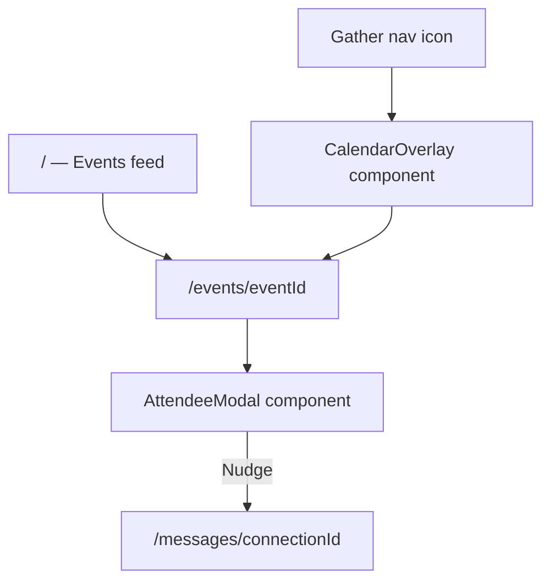

# Please Read This

**Start here.** Full map of every page, overlay, and component for the LinkedIn Events Hub.

## How navigation works

**Pages** = Next.js routes (URL changes).

**Overlays** = React components rendered on top of a page (no route). Open/close via state.



---

## App files (`app/`)

| File | Route | Type | Purpose |
|------|-------|------|---------|
| `app/layout.tsx` | *(all routes)* | Layout | Root shell — wraps every page; hosts `AppShell`, global nav, and calendar overlay slot |
| `app/globals.css` | — | Styles | CSS variables (`--li-*`), base typography, LinkedIn-like page background |
| `app/page.tsx` | `/` | **Page** | **Events feed** — browse/discover events; localized recommendations; click card → event detail |
| `app/events/[eventId]/page.tsx` | `/events/[eventId]` | **Page** | **Event detail** — banner, description, RSVP; attendee section; opens `AttendeeModal` |
| `app/messages/[connectionId]/page.tsx` | `/messages/[connectionId]` | **Page** | **Messaging** — thread + compose; `AiConnectionPanel` above compose (after Nudge) |

### Pages summary

| # | Route | Name | Purpose |
|---|-------|------|---------|
| 1 | `/` | Events feed | Home. Lists upcoming events. Entry point for discovery. |
| 2 | `/events/[eventId]` | Event detail | Single event view. RSVP. “248 attending” and “, X connections” open attendee modal. |
| 3 | `/messages/[connectionId]` | Messaging | Chat with a nudged attendee. AI assistant suggests conversation starters. |

---

## Overlays (`components/` — not routes)

| Component | File | Trigger | Purpose |
|-----------|------|---------|---------|
| **Calendar overlay** | `CalendarOverlay.tsx` | **Gather** icon in `LinkedInNav` | Outlook-style calendar (~80% viewport); month / week / day; RSVP’d events; click event → `/events/[eventId]` |
| **Attendee modal** | `AttendeeModal.tsx` | “248 attending”, “, X connections”, or connections strip on event detail | Scrollable guest list; filter chips; **Nudge** / **Nudged ✓** per row |

Both overlays use `linkedin/Modal.tsx` for backdrop and focus behavior.

---

## All components

Two folders only: `components/linkedin/` (primitives) and flat files at `components/` (everything else).

### Layout & shell (`components/`)

| Component | File | Used on | Purpose |
|-----------|------|---------|---------|
| `AppShell` | `AppShell.tsx` | `app/layout.tsx` | Nav + main content area + overlay mount point |
| `LinkedInNav` | `LinkedInNav.tsx` | `AppShell` | Top nav matching LinkedIn; includes **Gather** icon |

### Overlays (`components/`)

| Component | File | Used on | Purpose |
|-----------|------|---------|---------|
| `CalendarOverlay` | `CalendarOverlay.tsx` | `AppShell` | Gather calendar — enlarged overlay, view switcher, color-coded event blocks |
| `AttendeeModal` | `AttendeeModal.tsx` | Event detail page | Guest list popup with filters and Nudge actions |

### Events (`components/`)

| Component | File | Used on | Purpose |
|-----------|------|---------|---------|
| `EventFeed` | `EventFeed.tsx` | `/` | Fetches and renders list of events |
| `EventCard` | `EventCard.tsx` | `EventFeed` | Single event card — title, time, location; links to detail |
| `EventDetail` | `EventDetail.tsx` | `/events/[eventId]` | Banner, description, RSVP button, attendee section, connections strip |

### Messaging & AI (`components/`)

| Component | File | Used on | Purpose |
|-----------|------|---------|---------|
| `MessageThread` | `MessageThread.tsx` | `/messages/[connectionId]` | LinkedIn-style message history |
| `MessageCompose` | `MessageCompose.tsx` | `/messages/[connectionId]` | Text input and send button |
| `AiConnectionPanel` | `AiConnectionPanel.tsx` | `/messages/[connectionId]` | Collapsible panel — shared themes, mutual events, tappable talking points |

### LinkedIn primitives (`components/linkedin/`)

Reusable UI copied from LinkedIn patterns. Used across pages and overlays.

| Component | File | Purpose |
|-----------|------|---------|
| `Avatar` | `Avatar.tsx` | Profile photo circle |
| `AvatarStack` | `AvatarStack.tsx` | Overlapping attendee preview avatars |
| `Button` | `Button.tsx` | Primary, secondary, ghost variants |
| `Card` | `Card.tsx` | White surface card on `--li-bg` background |
| `ConnectionBadge` | `ConnectionBadge.tsx` | 1st / 2nd / 3rd degree indicator |
| `FilterChips` | `FilterChips.tsx` | Stacked, clearable filter chips |
| `Modal` | `Modal.tsx` | Centered modal / bottom sheet shell (used by overlays) |

---

## Component checklist (all files to create)

```
app/
├── layout.tsx                          ✓ exists — extend
├── page.tsx                            ✓ exists — rewrite as events feed
├── globals.css                         ✓ exists — extend with tokens
├── events/[eventId]/page.tsx           ○ create
└── messages/[connectionId]/page.tsx    ○ create

components/
├── AppShell.tsx                        ○ create
├── LinkedInNav.tsx                     ○ create
├── CalendarOverlay.tsx                 ○ create
├── EventFeed.tsx                       ○ create
├── EventCard.tsx                       ○ create
├── EventDetail.tsx                     ○ create
├── AttendeeModal.tsx                   ○ create
├── MessageThread.tsx                   ○ create
├── MessageCompose.tsx                  ○ create
├── AiConnectionPanel.tsx               ○ create
└── linkedin/
    ├── Avatar.tsx                      ○ create
    ├── AvatarStack.tsx                 ○ create
    ├── Button.tsx                      ○ create
    ├── Card.tsx                        ○ create
    ├── ConnectionBadge.tsx             ○ create
    ├── FilterChips.tsx                 ○ create
    └── Modal.tsx                       ○ create
```

**Total:** 3 pages · 2 overlays · 10 feature components · 7 LinkedIn primitives · 1 layout file · 1 global stylesheet

---

## Supporting code (not UI, feel free to ignore this for now)

| Path | Purpose |
|------|---------|
| `lib/api.ts` | Fetch helpers → Express (`localhost:3001`) |
| `lib/events.ts` | Event list, detail, RSVP helpers |
| `lib/attendees.ts` | Attendee list + filter helpers |
| `lib/ai-suggestions.ts` | Mock AI panel payload |
| `server/index.js` | Express API — loads `data/*.json` |
| `types/*.ts` | TypeScript models (`Event`, `User`, etc.) |

See [docs/ARCHITECTURE.md](./docs/ARCHITECTURE.md) for API endpoints and data linking.
