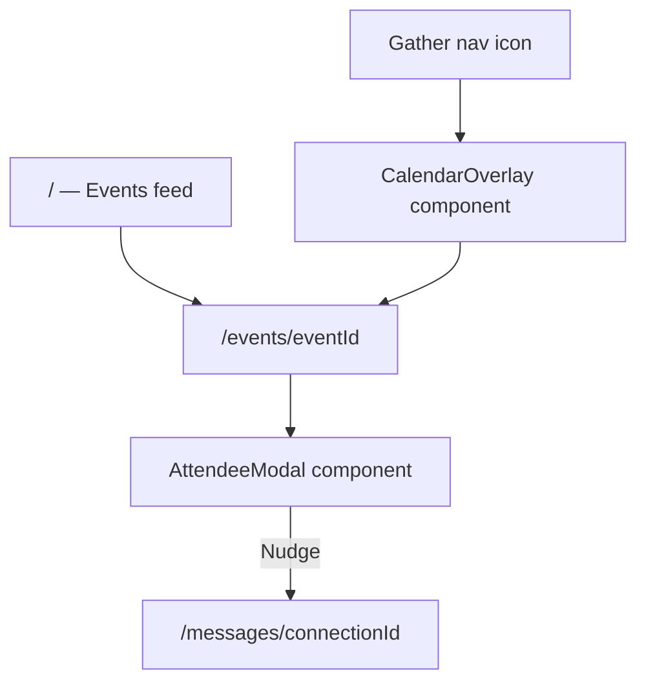

# App Map

**Start here.** Full map of every page, overlay, and component for the LinkedIn Events Hub.

---

## Main user (logged-in demo member)

**This is the fixed “you” for the entire app.** Every feature that needs a current member — RSVPs, connections, the events **Attending** filter, calendar overlay, nudge state, and **Also attending** overlap in the attendee modal — uses this one user. Do not pick a different user per page or per request.

| Field | Value |
|-------|-------|
| **Constant** | `MAIN_USER_ID` (`lib/mainUser.ts`, `server/lib/data.js`) |
| **Legacy alias** | `DEMO_USER_ID` (same value — kept for older code) |
| **User ID** | `user_5736` |
| **Name** | Alice Johnson |
| **Location** | Seattle, WA |
| **Override** | Set env `MAIN_USER_ID` to swap the demo user without code changes |

**Events Alice is attending** (`attending_event_ids` in `data/user_data.json` — 15 events, all June 2026):

| Event ID | Event name | Date |
|----------|------------|------|
| `event_0003` | Breaking Into Sales Representative Roles | 2026-06-29 |
| `event_0006` | Technology Data Scientist Networking Night | 2026-06-25 |
| `event_0013` | Breaking Into HR Coordinator Roles | 2026-06-09 |
| `event_0020` | Global Solutions LLC Career Insights Panel | 2026-06-01 |
| `event_0026` | Breaking Into Financial Analyst Roles | 2026-06-09 |
| `event_0027` | Meet Customer Service Managers in Retail | 2026-06-17 |
| `event_0043` | Technology Software Engineer Networking Night | 2026-06-25 |
| `event_0050` | Meet DevOps Engineers in Finance | 2026-06-17 |
| `event_0053` | Meet Sales Representatives in Finance | 2026-06-22 |
| `event_0055` | Meet Financial Analysts in Retail | 2026-06-07 |
| `event_0057` | Technology Data Scientist Networking Night | 2026-06-10 |
| `event_0058` | Meet Financial Analysts in Education | 2026-06-07 |
| `event_0060` | Technology Professionals Mixer | 2026-06-03 |
| `event_0068` | Meet HR Coordinators in Technology | 2026-06-22 |
| `event_0071` | Finance Professionals Mixer | 2026-06-13 |

**Where this matters in the UI:**

- **Events feed** (`/events`) — **Attending** filter shows only the three events above.
- **Event detail** — RSVP / “Attending ✓” is relative to Alice; attendee lists are everyone else in `attending_event_ids` for that event.
- **Attendee modal** — **Also attending** (green label) appears only when another guest shares at least one of Alice’s attending events (excluding the event you’re viewing).
- **Calendar overlay** — RSVP’d events for Alice (runtime state in `server/.demo-state.json` is layered on top of her profile).
- **AI / nudge flows** — Connection suggestions and nudges assume Alice is the actor.

**Code entry points:** `lib/mainUser.ts`, `server/lib/data.js` (`getMainUser()`, `getMainUserAttendingEventIds()`), `server/lib/events.js` (defaults `currentUserId` to `MAIN_USER_ID`).

See [ARCHITECTURE.md](./ARCHITECTURE.md#main-user) and [TECHNICAL_DECISIONS.md](./TECHNICAL_DECISIONS.md) for full rationale.

---

## How navigation works

**Pages** = Next.js routes (URL changes).

**Overlays** = React components rendered on top of a page (no route). Open/close via state.



---

## App files (`app/`)

| File | Route | Type | Purpose |
|------|-------|------|---------|
| `app/layout.tsx` | *(all routes)* | Layout | Root shell — wraps every page; hosts `AppShell`, global nav, and calendar overlay slot |
| `app/globals.css` | — | Styles | CSS variables (`--li-*`), base typography, LinkedIn-like page background |
| `app/page.tsx` | `/` | **Page** | **Events feed** — browse/discover events; localized recommendations; click card → event detail |
| `app/events/[eventId]/page.tsx` | `/events/[eventId]` | **Page** | **Event detail** — banner, description, RSVP; attendee section; opens `AttendeeModal` |
| `app/messages/[connectionId]/page.tsx` | `/messages/[connectionId]` | **Page** | **Messaging** — thread + compose; `AiConnectionPanel` above compose (after Nudge) |

### API routes (`app/api/`)

Next.js Route Handlers — same-origin `/api/*` for client `fetch()`; Server Components can import `server/lib/` directly instead.

| File | Path | Purpose |
|------|------|---------|
| `app/api/health/route.ts` | `GET /api/health` | Dataset record counts |
| `app/api/users/route.ts` | `GET /api/users` | All members |
| `app/api/users/[id]/route.ts` | `GET /api/users/:id` | Single member |
| `app/api/users/[id]/rsvps/route.ts` | `GET /api/users/:id/rsvps` | Calendar — RSVP'd events |
| `app/api/users/[id]/suggestions/route.ts` | `GET /api/users/:id/suggestions` | AI connection panel payload |
| `app/api/jobs/route.ts` | `GET /api/jobs` | All jobs |
| `app/api/jobs/[id]/route.ts` | `GET /api/jobs/:id` | Single job |
| `app/api/courses/route.ts` | `GET /api/courses` | All courses |
| `app/api/courses/[id]/route.ts` | `GET /api/courses/:id` | Single course |
| `app/api/events/route.ts` | `GET /api/events` | Event list (`?location=`, `?industry=`) |
| `app/api/events/[id]/route.ts` | `GET /api/events/:id` | Event detail + attendees |
| `app/api/events/[id]/attendees/route.ts` | `GET /api/events/:id/attendees` | Filtered attendee rows |
| `app/api/events/[id]/rsvp/route.ts` | `POST /api/events/:id/rsvp` | Toggle RSVP |
| `app/api/events/[id]/nudge/route.ts` | `POST /api/events/:id/nudge` | Record nudge |

### Pages summary

| # | Route | Name | Purpose |
|---|-------|------|---------|
| 1 | `/` | Events feed | Home. Lists upcoming events. Entry point for discovery. |
| 2 | `/events/[eventId]` | Event detail | Single event view. RSVP. “248 attending” and “, X connections” open attendee modal. |
| 3 | `/messages/[connectionId]` | Messaging | Chat with a nudged attendee. AI assistant suggests conversation starters. |

---

## Overlays (`components/` — not routes)

| Component | File | Trigger | Purpose |
|-----------|------|---------|---------|
| **Calendar overlay** | `CalendarOverlay.tsx` | **Gather** icon in `LinkedInNav` | Outlook-style calendar (~80% viewport); month / week / day; RSVP’d events; click event → `/events/[eventId]` |
| **Attendee modal** | `AttendeeModal.tsx` | “248 attending”, “, X connections”, or connections strip on event detail | Scrollable guest list; filter chips; **Nudge** / **Nudged ✓** per row |

Both overlays use `linkedin/Modal.tsx` for backdrop and focus behavior.

---

## All components

Two folders only: `components/linkedin/` (primitives) and flat files at `components/` (everything else).

### Layout & shell (`components/`)

| Component | File | Used on | Purpose |
|-----------|------|---------|---------|
| `AppShell` | `AppShell.tsx` | `app/layout.tsx` | Nav + main content area + overlay mount point |
| `LinkedInNav` | `LinkedInNav.tsx` | `AppShell` | Top nav matching LinkedIn; includes **Gather** icon |

### Overlays (`components/`)

| Component | File | Used on | Purpose |
|-----------|------|---------|---------|
| `CalendarOverlay` | `CalendarOverlay.tsx` | `AppShell` | Gather calendar — enlarged overlay, view switcher, color-coded event blocks |
| `AttendeeModal` | `AttendeeModal.tsx` | Event detail page | Guest list popup with filters and Nudge actions |

### Events (`components/`)

| Component | File | Used on | Purpose |
|-----------|------|---------|---------|
| `EventFeed` | `EventFeed.tsx` | `/` | Fetches and renders list of events |
| `EventCard` | `EventCard.tsx` | `EventFeed` | Single event card — title, time, location; links to detail |
| `EventDetail` | `EventDetail.tsx` | `/events/[eventId]` | Banner, description, RSVP button, attendee section, connections strip |

### Messaging & AI (`components/`)

| Component | File | Used on | Purpose |
|-----------|------|---------|---------|
| `MessageThread` | `MessageThread.tsx` | `/messages/[connectionId]` | LinkedIn-style message history |
| `MessageCompose` | `MessageCompose.tsx` | `/messages/[connectionId]` | Text input and send button |
| `AiConnectionPanel` | `AiConnectionPanel.tsx` | `/messages/[connectionId]` | Collapsible panel — shared themes, mutual events, tappable talking points |

### LinkedIn primitives (`components/linkedin/`)

Reusable UI copied from LinkedIn patterns. Used across pages and overlays.

| Component | File | Purpose |
|-----------|------|---------|
| `Avatar` | `Avatar.tsx` | Profile photo circle |
| `AvatarStack` | `AvatarStack.tsx` | Overlapping attendee preview avatars |
| `Button` | `Button.tsx` | Primary, secondary, ghost variants |
| `Card` | `Card.tsx` | White surface card on `--li-bg` background |
| `ConnectionBadge` | `ConnectionBadge.tsx` | 1st / 2nd / 3rd degree indicator |
| `FilterChips` | `FilterChips.tsx` | Stacked, clearable filter chips |
| `Modal` | `Modal.tsx` | Centered modal / bottom sheet shell (used by overlays) |

---

## Component checklist (all files to create)

```
app/
├── layout.tsx                          ✓ exists — extend
├── page.tsx                            ✓ exists — rewrite as events feed
├── globals.css                         ✓ exists — extend with tokens
├── events/[eventId]/page.tsx           ○ create
└── messages/[connectionId]/page.tsx    ○ create

components/
├── AppShell.tsx                        ○ create
├── LinkedInNav.tsx                     ○ create
├── CalendarOverlay.tsx                 ○ create
├── EventFeed.tsx                       ○ create
├── EventCard.tsx                       ○ create
├── EventDetail.tsx                     ○ create
├── AttendeeModal.tsx                   ○ create
├── MessageThread.tsx                   ○ create
├── MessageCompose.tsx                  ○ create
├── AiConnectionPanel.tsx               ○ create
└── linkedin/
    ├── Avatar.tsx                      ○ create
    ├── AvatarStack.tsx                 ○ create
    ├── Button.tsx                      ○ create
    ├── Card.tsx                        ○ create
    ├── ConnectionBadge.tsx             ○ create
    ├── FilterChips.tsx                 ○ create
    └── Modal.tsx                       ○ create
```

**Total:** 3 pages · 2 overlays · 10 feature components · 7 LinkedIn primitives · 1 layout file · 1 global stylesheet

---

## Supporting code (not UI, feel free to ignore this for now)

| Path | Purpose |
|------|---------|
| `lib/mainUser.ts` | **`MAIN_USER_ID`** — fixed demo member (`user_5736`, Alice Johnson); see top of this file |
| `lib/api.ts` | Fetch helpers for `/api/*` routes |
| `lib/events.ts` | Event detail, RSVP, calendar, and AI suggestion helpers |
| `lib/eventDetail.server.ts` | Server-side data loaders (event detail, health, related events) |
| `server/lib/` | Backend logic — loads `data/*.json`, RSVP state in `.demo-state.json` |
| `types/*.ts` | TypeScript models (`Event`, `User`, etc.) |

See [ARCHITECTURE.md](./ARCHITECTURE.md) for API endpoints and data linking.
